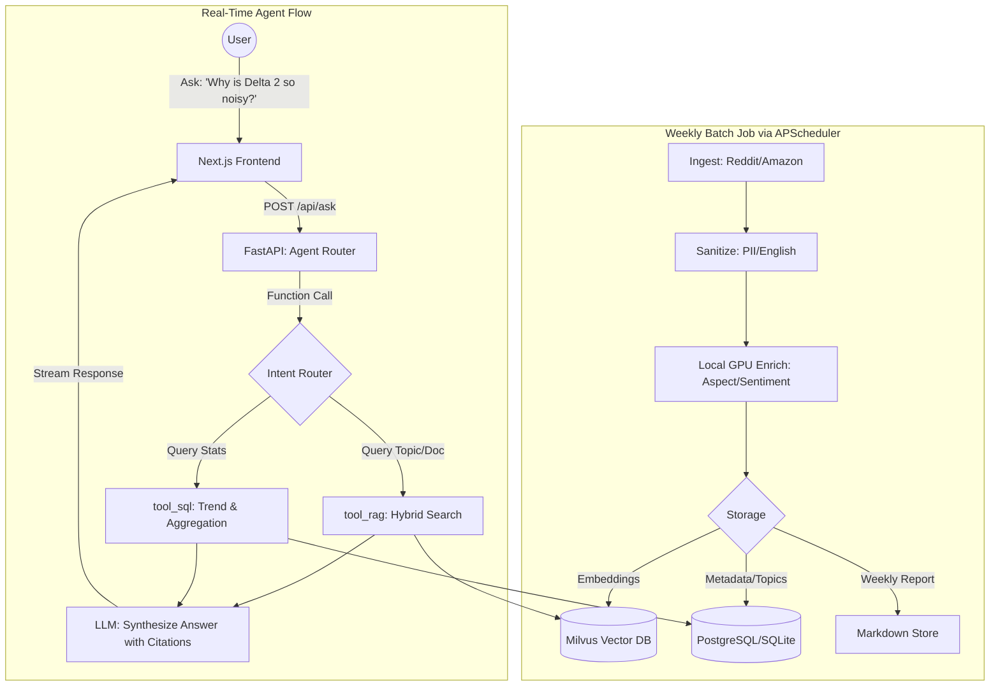

docs/arch.md
# Architecture & Key Decisions (Agent & RAG MVP)

## 0. Scope & Upgrades
- Target: Outdoor power stations VOC weekly intelligence + Interactive Agent.
- Major Upgrades from v1:
  - Added `/api/ask` RAG interface with Function Calling.
  - Upgraded to Async FastAPI + SQLAlchemy 2.0.
  - DB schema managed via Alembic (SQLite for local, PostgreSQL for prod).
  - Scheduling moved from OS cron to APScheduler.

## 1. System Topology
- **Data Ingestion (Pipelines):** Weekly batch processing, fetching, sanitizing, enriching, and indexing into Milvus & SQL.
- **Backend (FastAPI):** Exposes REST APIs for dashboards AND a Stateful Chat API for the Agent.
- **Agent Layer:** Uses LLM Function Calling to route user queries:
  - Route A (Analytics): Queries SQL metadata for trends, counts, and competitor scores.
  - Route B (Deep Dive): Queries Milvus for specific user quotes and semantic aspects.
  - Route C (Report): Fetches pre-generated weekly LLM summaries.

## 2. Project Directory Structure

```
voc-agent/
├── README.md
├── .gitignore
├── .env.example
├── pyproject.toml               # 增加 alembic, apscheduler, openai 等依赖
├── docs/
│   ├── arch.md                  # 架构决策（已更新 Agent & RAG 逻辑）
│   ├── todo.md                  # 重新排期的四周计划
│   ├── prompts.md               # 包含 RAG/Agent Function calling 的 prompt
│   └── data_contracts.md
├── backend/                     # 全面升级为异步架构
│   ├── app/
│   │   ├── main.py
│   │   ├── core/                # settings, security, DB 引擎初始化(async)
│   │   ├── api/
│   │   │   ├── routes/          # /ask, /weeks, /overview
│   │   │   └── dependencies.py  # 鉴权与 DB session 注入
│   │   ├── agent/               # ★ 新增：Agent 核心逻辑
│   │   │   ├── tool_sql.py      # 工具：查结构化数据（报表/趋势）
│   │   │   ├── tool_rag.py      # 工具：查 Milvus（原文/话题）
│   │   │   └── router.py        # Function Calling 意图路由
│   │   ├── services/
│   │   ├── db/
│   │   │   ├── models.py        # SQLAlchemy 声明
│   │   │   └── migrations/      # ★ 新增：Alembic 迁移脚本存放地
│   │   ├── repositories/        # 异步 DB/Milvus 访问封装
│   │   └── schemas/
│   ├── worker/                  # ★ 新增：独立或嵌入式调度（APScheduler）
│   │   ├── scheduler.py         # 定时触发 pipelines 脚本
│   │   └── jobs.py
│   ├── tests/
│   └── alembic.ini              # Alembic 配置文件
├── pipelines/                   # （保持原样，负责数据批处理底座）
│   ├── config/
│   ├── ingestion/
│   ├── sanitize/
│   ├── enrich/
│   ├── index/
│   ├── weekly/
│   └── runners/
├── shared/
│   ├── llm/
│   └── eval/                    # ★ 升级：增加 RAG 回答准确度(Faithfulness)评估脚本
├── frontend/                    # Next.js
│   ├── app/
│   │   ├── (dashboard)/         # 传统的看板页
│   │   └── ask/                 # ★ 新增：Ask your data 对话界面
│   ├── components/
│   │   └── ChatBox.tsx          # 聊天组件，支持展示引用的 Markdown
│   └── lib/
└── ops/
└── docker/                  # docker-compose (包含 Postgres + Milvus)
```

### 2.1 Directory-to-Topology Mapping

| Topology Layer | Directory | Key Files |
|---|---|---|
| Data Ingestion | `pipelines/` | `ingestion/`, `sanitize/`, `enrich/`, `index/`, `weekly/` |
| Batch Scheduling | `backend/worker/` | `scheduler.py`, `jobs.py` |
| Backend API | `backend/app/api/` | `routes/`, `dependencies.py` |
| Agent (Intent Routing) | `backend/app/agent/` | `router.py` |
| Agent (SQL Tool) | `backend/app/agent/` | `tool_sql.py` |
| Agent (RAG Tool) | `backend/app/agent/` | `tool_rag.py` |
| DB Models & Migrations | `backend/app/db/` | `models.py`, `migrations/` |
| Data Access | `backend/app/repositories/` | async DB / Milvus wrappers |
| Core Config & Init | `backend/app/core/` | settings, security, async engine |
| Frontend Dashboard | `frontend/app/(dashboard)/` | — |
| Frontend Ask UI | `frontend/app/ask/`, `components/ChatBox.tsx` | — |
| Evaluation | `shared/eval/` | `rag_eval.py` |
| LLM Utilities | `shared/llm/` | — |
| Infrastructure | `ops/docker/`, `alembic.ini` | docker-compose (Postgres + Milvus) |

## 3. Core Logic Flowchart (Including Agent RAG)



## 4. Storage & Migration Strategy
- **ORM:** SQLAlchemy 2.0 with `asyncio` extension.
- **Migrations:** Alembic. We define models in Python, use `alembic revision --autogenerate` to manage schema changes seamlessly across SQLite and PostgreSQL.
- **Vector Index:** Milvus (Hybrid search: metadata filtering + vector similarity).

## 5. Evaluation Strategy (LLM-as-a-Judge)
- `shared/eval/rag_eval.py`: A custom script to measure:
  - **Context Relevance:** Did Milvus retrieve useful chunks?
  - **Faithfulness:** Is the LLM's answer grounded in the retrieved chunks (no hallucination)?
  - **Answer Relevance:** Does it actually answer the user's prompt?
- Driven by a golden dataset of 50 common questions.