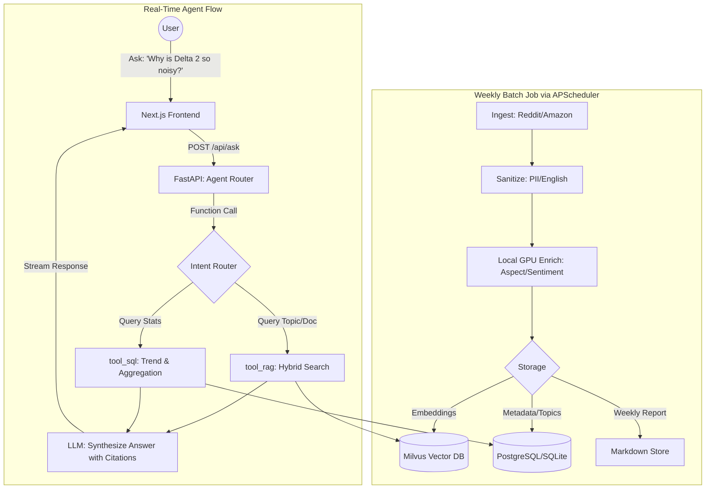

# Architecture & Key Decisions (Agent & RAG MVP)

## 0. Scope & Upgrades
- Target: Outdoor power stations VOC weekly intelligence + Interactive Agent.
- Major Upgrades from v1:
  - Added `/api/ask` RAG interface with Function Calling.
  - Upgraded to Async FastAPI + SQLAlchemy 2.0.
  - DB schema managed via Alembic (SQLite for local, PostgreSQL for prod).
  - Scheduling moved from OS cron to APScheduler.

## 1. System Topology
- **Data Ingestion (Pipelines):** Weekly batch processing, fetching, sanitizing, enriching, and indexing into Milvus & SQL.
- **Backend (FastAPI):** Exposes REST APIs for dashboards AND a Stateful Chat API for the Agent.
- **Agent Layer:** Uses LLM Function Calling to route user queries:
  - Route A (Analytics): Queries SQL metadata for trends, counts, and competitor scores.
  - Route B (Deep Dive): Queries Milvus for specific user quotes and semantic aspects.
  - Route C (Report): Fetches pre-generated weekly LLM summaries.

## 2. Core Logic Flowchart (Including Agent RAG)

## 3. Storage & Migration Strategy
- **ORM:** SQLAlchemy 2.0 with `asyncio` extension.
- **Migrations:** Alembic. We define models in Python, use `alembic revision --autogenerate` to manage schema changes seamlessly across SQLite and PostgreSQL.
- **Vector Index:** Milvus (Hybrid search: metadata filtering + vector similarity).

## 4. Evaluation Strategy (LLM-as-a-Judge)
- `shared/eval/rag_eval.py`: A custom script to measure:
  - **Context Relevance:** Did Milvus retrieve useful chunks?
  - **Faithfulness:** Is the LLM's answer grounded in the retrieved chunks (no hallucination)?
  - **Answer Relevance:** Does it actually answer the user's prompt?
- Driven by a golden dataset of 50 common questions.